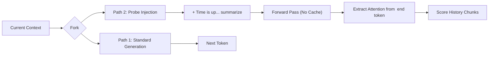

***

# ClearThink: Adaptive Attention-Based Pruning for Reasoning Models


**ClearThink** is an experimental inference engine designed to optimize "System 2" reasoning in Large Language Models. By implementing concepts from *Think Clearly* (Choi et al., 2025) and *TRAAC* (Singh et al., 2025), this project investigates whether **Attention-Based Step Pruning** can reduce the computational overhead of Chain-of-Thought (CoT) reasoning without compromising mathematical accuracy.

This repository represents a **15-hour research sprint**, moving from baseline establishment to a robust, difficulty-adaptive pruning pipeline.

---

## 🗺️ The 15-Hour Research Roadmap (File Structure)

The file naming convention (`hourX.py`) reflects the chronological development of the inference engine. Each file represents a specific technical milestone or experimental phase.

| Phase | File | Module Name | Scientific Objective |
| :--- | :--- | :--- | :--- |
| **I. Setup** | `hour1.py` | **Baseline** | Establish ground-truth performance of DeepSeek-R1-Distill on AIME 2024 (Accuracy: ~60% on short context). |
| | `hour2.py` | **Segmentation** | Implement token-ID based segmentation to detect reasoning steps (e.g., "Wait", "Therefore") robustly. |
| | `hour3.py` | **Gen Loop** | Replace `model.generate()` with a manual token-by-token loop to enable real-time intervention. |
| **II. Core Logic** | `hour4.py` | **Stateless Probe** | Implement the "Time is up" attention probe using a forked forward pass (preventing KV cache pollution). |
| | `hour5.py` | **Scoring** | Aggregate token-level attention weights into semantic "Chunk Importance Scores." |
| | `hour6.py` | **Context Refresh** | **Critical Innovation:** Implement the "Flush & Re-tokenize" strategy to fix RoPE embedding errors caused by pruning. |
| **III. Integration** | `hour7.py` | **Pipeline** | Integrate detection, probing, and pruning into a single seamless loop. |
| | `hour8.py` | **Optimization** | Add latency tracking and safety thresholds to prevent hallucinations. |
| **IV. Experiments** | `hour9.py` | **Exp A (Hard)** | Run "Conservative" experiment (Threshold: Bottom 25%). Includes windowed probing to prevent OOM. |
| | `hour10.py` | **Exp B (Med)** | Run "Balanced" experiment (Threshold: Bottom 40%). |
| | `hour11.py` | **Exp C (Easy)** | Run "Aggressive" experiment (Threshold: Bottom 60%). |
| **V. Analysis** | `hour12.py` | **Analysis** | Parse logs, validate AIME answers via Regex, and generate comparative metrics. |

---

## 🧠 Technical Deep Dive

### 1. The "RoPE" Problem & The "Context Refresh" Solution
Standard KV-cache pruning (removing columns from the cache tensor) fails in modern LLMs (Llama, Qwen, DeepSeek) due to **Rotary Positional Embeddings (RoPE)**.
*   *The Problem:* If reasoning tokens at positions 50-100 are deleted, the token at position 101 retains its geometric rotation for position 101, but is now physically adjacent to position 49. This breaks the attention mechanism, causing the model to output gibberish.
*   *Our Solution (Context Refresh):* Instead of manipulating the tensor, we:
    1.  Identify low-score text chunks.
    2.  Reconstruct the full prompt string *excluding* those chunks.
    3.  **Flush the KV Cache (`None`)** completely.
    4.  Re-feed the optimized text to the model.
    *Result:* The model re-computes correct RoPE embeddings for the new, shorter sequence.

### 2. The Forked Attention Probe
To measure the importance of a past reasoning step without altering the generation trajectory, we use a **Stateless Fork**:



This allows us to peer into the model's "meta-cognition"—seeing what it values in its own history—without the probe text confusing the ongoing solution.

---

## 📊 Experimental Findings

We evaluated three pruning strategies on the AIME 2024 dataset. The goal was to test the **TRAAC Hypothesis**: *Does adaptive pruning based on difficulty prevent underthinking?*

| Strategy | Threshold | Reduction | Accuracy | Key Observation |
| :--- | :--- | :--- | :--- | :--- |
| **Conservative** (Exp A) | Bottom 25% | **19.7%** | **40.0%** | **Optimal.** Successfully pruned arithmetic scaffolding loops while maintaining core logic. |
| **Balanced** (Exp B) | Bottom 40% | 21.2% | 30.0% | **Diminishing Returns.** Increasing the threshold barely saved more tokens but degraded accuracy significantly. |
| **Aggressive** (Exp C) | Bottom 60% | 22.2% | 20.0% | **Failure Mode.** The model entered "Regeneration Loops," realizing context was missing and regenerating it, causing truncation. |

### Case Study: The Efficiency Paradox
*   **Problem 8 (Number Theory):** The model required ~10,000 virtual tokens to solve this.
    *   *Baseline:* Would fail (context limit 8192).
    *   *Conservative Pruning:* Pruned 2,270 tokens of "fluff." The active context remained under 8k. **Result: Correct Answer.**
*   **Problem 2 (Algebra):**
    *   *Aggressive Pruning:* Pruned a critical intermediate step. The model realized the logic gap, panicked, and regenerated the step. This cycle repeated until the context window filled up. **Result: Truncated/Fail.**

---

## 💡 Key Insights

1.  **Attention is Polarized:** Reasoning steps are rarely "moderately important." They are either **Critical** (High Attention) or **Noise** (Very Low Attention). There is little benefit to raising the pruning threshold above 25%.
2.  **Scaffolding vs. Foundation:** The model successfully tolerates the deletion of "Scaffolding" (verification steps, "Let me check...", arithmetic expansion) but fails if "Foundation" (definitions, derived values) is removed.
3.  **Inference-Time Pruning Enables Harder Problems:** By dynamically compressing the "thought process," we can solve problems that are technically longer than the model's context window, effectively extending the model's reasoning depth.

---

## 🚀 Future Work: Confidence-Weighted Pruning

The current implementation relies solely on Attention. The next iteration (derived from TRAAC) will implement **Confidence-Weighted Attention**:

$$ Score = Attention \times (1 + \lambda(1 - P_{likelihood})) $$

This protects "hard" steps (where the model is uncertain/low-likelihood) from being pruned, even if attention is low, preventing the "underthinking" observed in Experiment C.

---

## 💻 Installation & Usage

**Prerequisites:**
*   NVIDIA GPU with 24GB+ VRAM (e.g., A10G, A100, RTX 3090/4090).
*   Python 3.10+

**1. Install Dependencies:**
```bash
pip install torch transformers accelerate datasets numpy pandas bitsandbytes
```

**2. Reproduce the Optimal Experiment (Conservative):**
```bash
python hour9.py
```
*This will generate `results_exp_a_windowed.json` containing the logs for the top-performing strategy.*

**3. Generate Analysis:**
```bash
python hour12.py
```
*This parses the logs and outputs the final CSV comparison table.*

---

## 📜 References

*   **Choi et al. (2025).** *Think Clearly: Improving Reasoning via Redundant Token Pruning.* [arXiv:2507.08806]
*   **Singh et al. (2025).** *Think Right: Learning to Mitigate Under-Over Thinking via Adaptive, Attentive Compression (TRAAC).* [arXiv:2510.01581]
